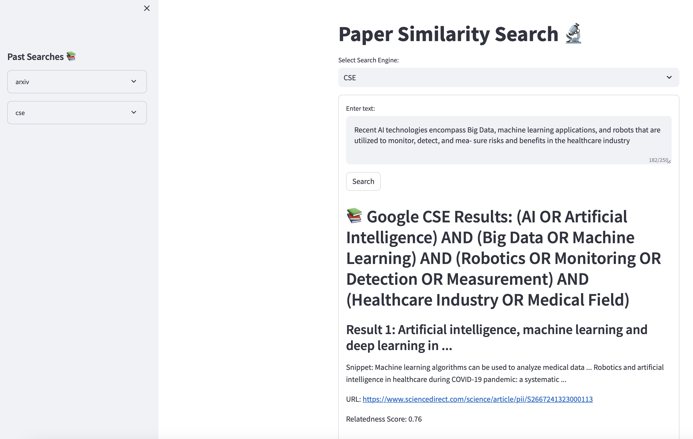

# Paper Similarity Search 🔬



This project is a web application that allows users to search for academic papers and articles based on a given query. It utilizes the arXiv API and Google Custom Search Engine (CSE) to retrieve relevant results and ranks them based on their similarity to the query using embeddings and cosine similarity.

## Features

- Search for academic papers on arXiv and articles using Google CSE
- Generate keywords in boolean format for the given query using a language model
- Calculate relatedness scores between the query and search results using embeddings
- Display search results with titles, summaries, publication dates, URLs, and relatedness scores
- Store past searches and allow users to revisit them
- Delete past searches from the sidebar

## Technologies Used

- Python
- Streamlit
- arXiv API
- Google Custom Search API
- Ollama (for embeddings and language model)
- Pandas
- SciPy
- Langchain

## Setup

1. Clone the repository
2. pip install -r requirements.txt 
3. Create a `.env` file in the project directory. 
4. Obtain API key for:
    * Google Custom Search Engine ([https://developers.google.com/custom-search](https://developers.google.com/custom-search))
5. Add the following to your `.env` file:

   ```
   GOOGLE_CSE_KEY=your_cse_api_key
   GOOGLE_CSE_ID=your_cse_engine_id
   ```

## Usage

1. Select the search engine (arXiv or Google CSE)
2. Enter a query in the text area
3. Click the "Search" button to retrieve relevant results
4. View the search results with their titles, summaries, URLs, and relatedness scores
5. Access past searches from the sidebar and revisit or delete them

## Folder Structure

- `arxiv/`: Contains CSV files with past arXiv search results
- `cse/`: Contains CSV files with past Google CSE search results

## Contributing

Contributions are welcome! If you find any issues or have suggestions for improvements, please open an issue or submit a pull request.

## License

This project is licensed under the [MIT License](LICENSE).